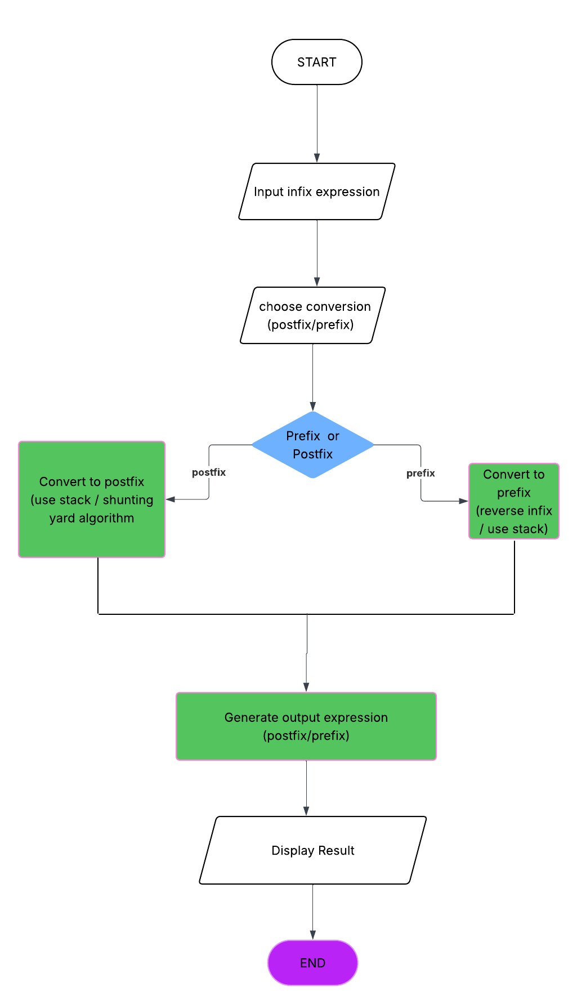

# Infix Converter Project

##  Overview
This project converts infix expressions into **postfix** or **prefix** notation.  
It is implemented in Java and documented with pseudocode and workflow diagrams.

## Features
- Accepts infix expressions as input
- Converts to postfix or prefix based on user choice
- Handles invalid choices with prompts until valid input is given
- Clear pseudocode and workflow diagram included for documentation

## Pseudocode
The main program logic is described in [pseudocode.md](pseudocode.md).

##  Workflow Diagram


*(Exported from Lucidchart and saved in the `diagrams/` folder)*

## How to Run
1. Clone the repository:
   ```bash
   git clone https://github.com/YourUsername/InfixConverter.git